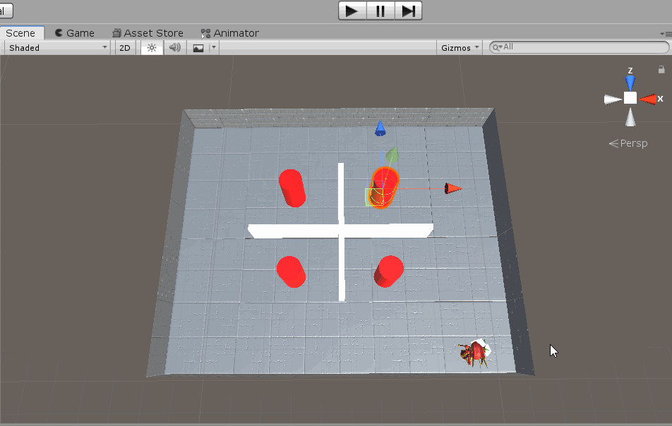
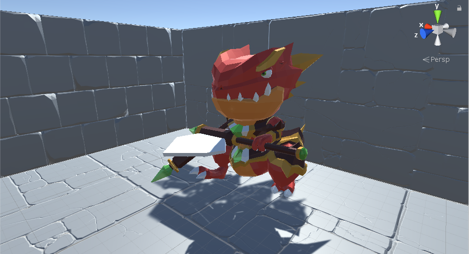
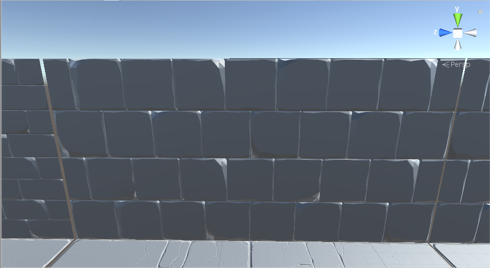
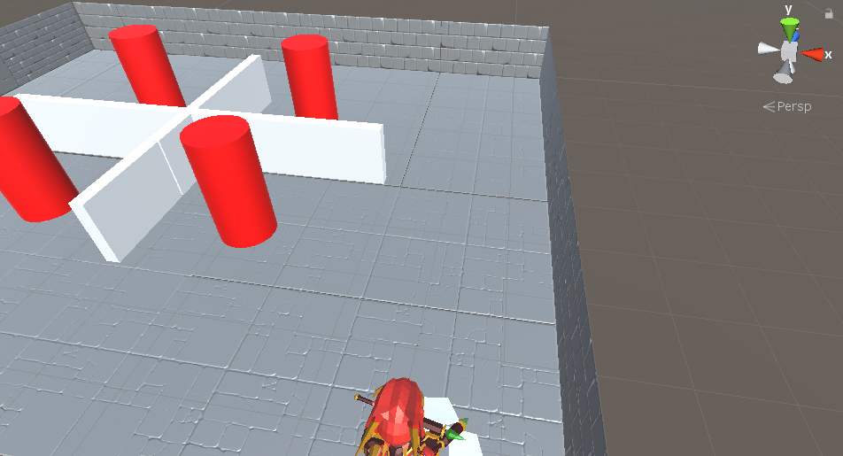
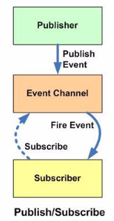

# Unity 第七次作业
| 姓名| 学号| 日期|
|:-:|:-:|:-:|
| 张浩轩| 17343149| 2019/10/26|

- [智能巡逻兵](#total)
- [运行截图](#img)
    - [视频网址](#stream)
- [具体模型](#model)
- [发布订阅模式](#message)
- [源代码](#code)
    - [player_movement.cs](#player)
    - [UI.cs](#ui)
    - [MonsterMove.cs](#monstermove)
    - [Judge.cs](#judge)

<h2 id="total"> 智能巡逻兵</h2>

- 提交要求：
- 游戏设计要求：
    - 创建一个地图和若干巡逻兵(使用动画)；
    - 每个巡逻兵走一个3~5个边的凸多边型，位置数据是相对地址。即每次确定下一个目标位置，用自己当前位置为原点计算；
    - 巡逻兵碰撞到障碍物，则会自动选下一个点为目标；
    - 巡逻兵在设定范围内感知到玩家，会自动追击玩家；
    - 失去玩家目标后，继续巡逻；
    - 计分：玩家每次甩掉一个巡逻兵计一分，与巡逻兵碰撞游戏结束  

<h3 id="img"> 运行截图</h3>

  
<h4 id="stream"> 视频网址:</h4>

[http://www.iqiyi.com/w_19sbavu495.html](http://www.iqiyi.com/w_19sbavu495.html)

<h3 id="model"> 具体模型</h3>

Player: 在Asset Store中搜索Dragon可以得到下面的模型  
  
Wall: Search StoneWall  
  
Map: 整体的布局如下  
   

<h3 id="message">发布订阅模式</h3>

订阅者把自己想订阅的事件注册到调度中心，当该事件触发时候，发布者发布该事件到调度中心（顺带上下文），由调度中心统一调度订阅者注册到调度中心的处理代码.  
比如有个界面是实时显示天气，它就订阅天气事件（注册到调度中心，包括处理程序），当天气变化时（定时获取数据），就作为发布者发布天气信息到调度中心，调度中心就调度订阅者的天气处理程序。  
  
针对此游戏来讲, 我们定义两种消息, Catch与PlayerPosition, Catch用来处理Player被Monster追击到的情况, PlayerPosition用来发布Player自身的坐标信息, 从而给Monster发现并追击的机会.

<h3 id="code"> 源代码</h3>

<h4 id="player"> player_movement.cs</h4>

管理Player的移动与旋转, 并进行消息的发布和订阅, 具体发布Catch和PlayerPosition两个消息, 当Player在运动过程中与巡逻兵发生碰撞时会触发OnCollisionEnter()函数, 进一步发布Catch消息, 通知场景控制器游戏结束. PlayerPosition消息是用来通知Monster自己的坐标位置, 从而距离小于一定值的时候Monster发现自己并开始追击.
```c#
using UnityEngine;

namespace SwordWorld
{
    public class player_movement
        : MonoBehaviour
    {
        public float walk_speed = 30f;
        public float run_speed = 30f;


        private Vector3 movement;
        private Animator animator;
        private Rigidbody playerRigidbody;

        // rotate
        public float turnSmoothing = 3.0f;
        private Transform cameraTransform;
        private bool isWalk;
        private bool isRun;
        private float h;
        private float v;

        // jump
        public float jumpHeight = 5.0f;
        public float jumpCooldown = 1.0f;
        private bool isJump;
        
        void Awake()
        {
            // Set up references.
            animator = GetComponent<Animator>();
            playerRigidbody = GetComponent<Rigidbody>();

            cameraTransform = Camera.main.transform;
        }

        void Update()
        {
            h = Input.GetAxisRaw("Horizontal");
            v = Input.GetAxisRaw("Vertical");
            isJump = Input.GetButtonDown("Jump");
            isWalk = Mathf.Abs(h) > 0.1 || Mathf.Abs(v) > 0.1;

            if (isWalk)
            {
                if (isRun)
                {
                    isRun = !Input.GetButtonUp("Run");
                }
                else
                {
                    isRun = Input.GetButtonDown("Run");
                }
            }
            else
            {
                isRun = false;
            }
        }

        void FixedUpdate()
        {
            // Move the player around the scene.
            Move(h, v);

            // Turn the player to face the mouse cursor. 
            Rotate(h, v);

            // Jump
            Jump(h, v);
        }

        void Move(float h, float v)
        {
            float speed = isRun ? run_speed : walk_speed;

            // Set the movement vector based on the axis input.
            movement.Set(h, 0.0f, v);

            // Normalise the movement vector and make it proportional to the speed per second.
            movement = movement.normalized * speed * Time.deltaTime;

            // Move the player to it's current position plus the movement.
            playerRigidbody.MovePosition(transform.position + movement);

            // Animator
            {
                if (isRun)
                {
                    animator.SetBool("IsRun", isRun);
                }
                else
                {
                    animator.SetBool("IsRun", isRun);
                    animator.SetBool("IsWalk", isWalk);
                }
            }
        }

        void Jump(float h, float v)
        {
            if (isJump)
            {
                animator.SetTrigger("Jump");
                playerRigidbody.velocity = new Vector3(0, jumpHeight, 0);
            }
        }

        Vector3 Rotate(float h, float v)
        {
            Vector3 forward = cameraTransform.TransformDirection(Vector3.forward);
            forward = forward.normalized;

            Vector3 right = new Vector3(forward.z, 0, -forward.x);

            Vector3 targetDirection;
            targetDirection = forward * v + right * h;

            if ((isWalk && targetDirection != Vector3.zero))
            {
                Quaternion targetRotation = Quaternion.LookRotation(targetDirection, Vector3.up);

                Quaternion newRotation = Quaternion.Slerp(GetComponent<Rigidbody>().rotation, targetRotation, turnSmoothing * Time.deltaTime);

                // TODO：不知为毛，Rigid 的约束不起作用，只能手动设置为 0 
                newRotation.x = 0f;
                newRotation.z = 0f;
                GetComponent<Rigidbody>().MoveRotation(newRotation);
            }

            return targetDirection;
        }
    }
}
```  
<h4 id="ui"> UI.cs</h4>

UI部分主要负责管理Score
```c#
using System.Collections;
using System.Collections.Generic;
using UnityEngine;

public class UI : MonoBehaviour
{
    public static int score = 0;
    private GUIStyle style;
    public static bool is_end = false;
    // Start is called before the first frame update
    void Start()
    {
        style = new GUIStyle();
        style.fontSize = 30;
    }

    // Update is called once per frame
    void Update()
    {
        
    }

    private void OnGUI() {
        if (is_end) {
            GUI.Label(new Rect(Screen.width / 4, Screen.height / 4, 200, 100), "Game Over, your score is : " + score, style);
        } else {
            GUI.Label(new Rect(Screen.width / 10, Screen.height / 10, 200, 100), "Score: " + score, style);
        }
    }
}
```  
<h4 id="monstermove"> MonsterMove.cs</h4>

MonsterMove脚本负责管理Monster的移动, 并且订阅PlayerPosition消息, 从而获取Player当前的坐标信息, 当距离小于一定值的时候就会触发追击函数, 也就是Monster发现了Player, 并加快速度进行追击.
```c#
using System.Collections;
using System.Collections.Generic;
using UnityEngine;

public class MonsterMove : MonoBehaviour
{
    private float speed = 3.0f;
    private float mtime = 3.0f;

    private float x, z;
    private Vector3 vec;
    private bool is_run = true;

    private bool is_chase = false;
    // Start is called before the first frame update
    void Start()
    {
        
    }

    // Update is called once per frame
    void Update()
    {
        vec = this.gameObject.transform.position;
        mtime += Time.deltaTime;
        if (getDistance(Judge.x, Judge.z, vec.x, vec.z) < 30) {
            is_chase = true;
            mtime = 3.0f;
            speed = 11.0f;
            float theta = Mathf.Atan(Mathf.Abs(vec.z - Judge.z) / Mathf.Abs(vec.x - Judge.x));
            if (vec.x < Judge.x) {
                this.gameObject.transform.Translate(Vector3.right * speed * Time.deltaTime * Mathf.Cos(theta));
            } else {
                this.gameObject.transform.Translate(Vector3.left * speed * Time.deltaTime * Mathf.Cos(theta));
            }
            if (vec.z < Judge.z) {
                this.gameObject.transform.Translate(Vector3.forward * speed * Time.deltaTime * Mathf.Sin(theta));
            } else {
                this.gameObject.transform.Translate(Vector3.back * speed * Time.deltaTime * Mathf.Sin(theta));
            }
            this.transform.rotation = Quaternion.Euler(new Vector3(0, 0, 0));
            return;
        }else if(mtime >= 3) {
            if (is_chase) {
                is_chase = false;
                if(!UI.is_end)
                    UI.score += 1;
            }
            speed = 3.0f;
            mtime -= 3;
            float ori_x = vec.x, ori_z = vec.z;
            float x_min = vec.x - 20;
            float x_max = vec.x + 20;
            float z_min = vec.z - 20;
            float z_max = vec.z + 20;
            x = Random.Range(x_min, x_max);
            while(Mathf.Abs(x - ori_x) < 10) {
                x = Random.Range(x_min, x_max);
            }
            z = Random.Range(z_min, z_max);
            while (Mathf.Abs(z - ori_z) < 10) {
                z = Random.Range(z_min, z_max);
            }
        }
        if(x < vec.x) {
            this.gameObject.transform.Translate(Vector3.right * speed * Time.deltaTime);
        } else {
            this.gameObject.transform.Translate(Vector3.left * speed * Time.deltaTime);
        }
        if(z < vec.z) {
            this.gameObject.transform.Translate(Vector3.forward * speed * Time.deltaTime);
        } else {
            this.gameObject.transform.Translate(Vector3.back * speed * Time.deltaTime);
        }
        this.transform.rotation = Quaternion.Euler(new Vector3(0, 0, 0));
    }

    private void OnCollisionEnter(Collision collision) {
        
    }

    float getDistance(float x1, float y1, float x2, float y2) {
        return Mathf.Sqrt(Mathf.Pow(Mathf.Abs(x1 - x2), 2) + Mathf.Pow(Mathf.Abs(y1 - y2), 2));
    }
}
```
<h4 id="judge"> Judge.cs</h4>

Judge脚本与场景控制器协同负责判断游戏的结束.
```c#
using System.Collections;
using System.Collections.Generic;
using UnityEngine;

public class Judge : MonoBehaviour
{
    public static float x;
    public static float z;
    private int count = 0;
    // Start is called before the first frame update
    void Start()
    {
        x = this.gameObject.transform.position.x;
        z = this.gameObject.transform.position.z;
    }

    // Update is called once per frame
    void Update()
    {
        x = this.gameObject.transform.position.x;
        z = this.gameObject.transform.position.z;
    }

    private void OnCollisionEnter(Collision collision) {
        string str = collision.gameObject.name;
        if (getSameCount(str, "Cylinder") >= 5)
            UI.is_end = true;
    }

    private int getSameCount(string str1, string str2) {
        int len = str1.Length > str2.Length ? str2.Length : str1.Length;
        int count = 0;
        for(int i = 0; i < len; ++i) {
            if (str1[i] == str2[i]) ++count;
            else return count;
        }
        return count;
    }
}
```
